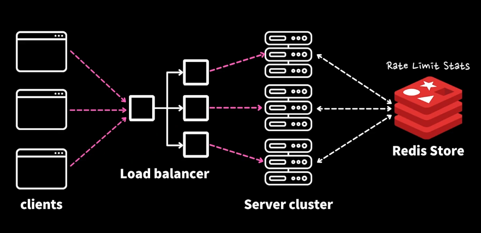

# 27. 서버 지키기

## 27.1 챕터 소개

- rate limiting을 배우고 dwitter 프로젝트에 적용

## 27.2 Rate Limiting이란?

- 동시 다발적으로 여러 요청을 보내는 것을 막는 것
- Rate limiting 관리
  - API Management platforms
    - Business products 사용
      - e.g.
        - Tyk.io
        - apigee
      - 불필요한 기능들이 포함되어 있을 수 있고 비용이 부담될 수 있음
    - Cloud services
      - e.g.
        - AWS API Gateway
        - Google Cloud API Gateway
      - 간편하긴 하지만 정말 내 서비스에 맞게 변형하거나 세부적인 기능설정에 한계가 있음
    - 대부분 직접 구현

### 왜 Rate Limiting을 사용해야 해야하는가?

- DDoS(Denial of service attack) 공격을 막기 위해
- 시스템의 안정성 보장
- 사용자들간의 공평성을 유지
  - 한 사용자가 너무 많은 API를 사용해서 다른 사람들이 사용할 수 없게 하는 것을 막기 위해
- 사용자들 마다 다른 서비스를 제공하게 할 수 있음

### 상태코드 429 : Too Many Requests

- headers에 Retry-After를 넣어서 얼마나 기다려야 하는지 알려줄 수 있음(권고 사항)

### Global API Rate Limiting

- 글로벌하게 적용

### Per User API Rate Limiting

- 사용자별로 적용

### Combined API Rate Limiting

- Global + Per User
- 글로벌하게 적용하되, 사용자별로도 적용

### Rate limiting in production

- 사용자가 많은 규모 있는 서비스는 여러 서버 클러스터를 이용해서 서비스를 구동
  - 로드 밸런서를 이용해서 요청을 분산
  - `+` Redis Store

## 27.3 주요 4가지 알고리즘

- API 관리 서비스나 클라우드 서비스는 우리가 원하는 특화된 기능을 제공해주는 경우는 거의 없음 => 직접 구현하기 위해 알고리즘을 알아야 되는 이유

### 1. Fixed Window

- 일정 시간동안 일정 횟수만큼 요청을 허용
- 단점 : 해당 간격 사이에 많이 몰릴 수 있음

### 2. Sliding Window

- Fixed Window를 개선
- 현재 들어온 요청을 기준으로 앞 뒤로 일정 간격만큼 시간텀으로 들어온 요청을 카운트

### 3. Leaky bucket

- 동시 다발적으로 들어오는 요청들을 양동이에 받아 놓고
- 천천히 떨어지도록 함
- 장점 : 시스템의 과부하를 줄일 수 있지만
- 단점 : 특정 시간대에 몰리는 서비스라면, 그 시간대에는 서비스가 불가능할 수 있음

### 4. Token Bucket

- Leaky bucket의 개선
- 특정 토큰이 있고 토큰 개수만큼 요청을 허용
  - 요청에 대한 처리가 끝나면 토큰을 토큰 버킷에 반환

### 정리

- Window 관련 - 구현 심플, 메모리 상 보관 적음, 효율적
- Bucket들

  - 큐를 사용
  - 메모리 상에 보관해야되는 양도 조금 늘어나고
  - 윈도우보다 구현이 복잡
  - 그래도 통상적으로 현업에선 버킷을 더 많이 사용

- 지금까진 서버에서 이야기를 했지만 클라이언트에서 429 응답을 받으면 어떻게 우아하게 처리할 수 있는지 이야기해보자

## 27.4 프론트엔드 대처 방법

### Client side considerations

- 429 응답을 받으면 어떻게 처리할 것인가?
- 429 응답을 받으면 얼마나 기다려야 하는지 알려주는 Retry-After 헤더를 받을 수 있음
- 이 헤더를 받으면 그 시간만큼 기다렸다가 다시 요청을 보내면 됨

- 재시도 시 유의점
  - Jitter(변동 폭)를 이용
    - 재시도 시간을 랜덤하게 조금씩 바꿔서 보내는 것
    - 서버에 부하를 줄이기 위해

## 27.5 백엔드 구현하기

- 미들웨어로 express-rate-limit 라이브러리를 사용

## 27.6 백엔드 알고리즘 살펴보기

- 실제 소스코드를 보면 몇줄 되지 않음
- https://github.com/express-rate-limit/express-rate-limit

## 27.7 프론트엔드 - Axios 사용하기

### client side considerations

- 429 응답을 받으면 특정한 시간 뒤에 재시도
- 재시도 후에도 429 응답을 받으면 다시 좀 더 많은 시간텀을 가지고 재시도 + Jitter
